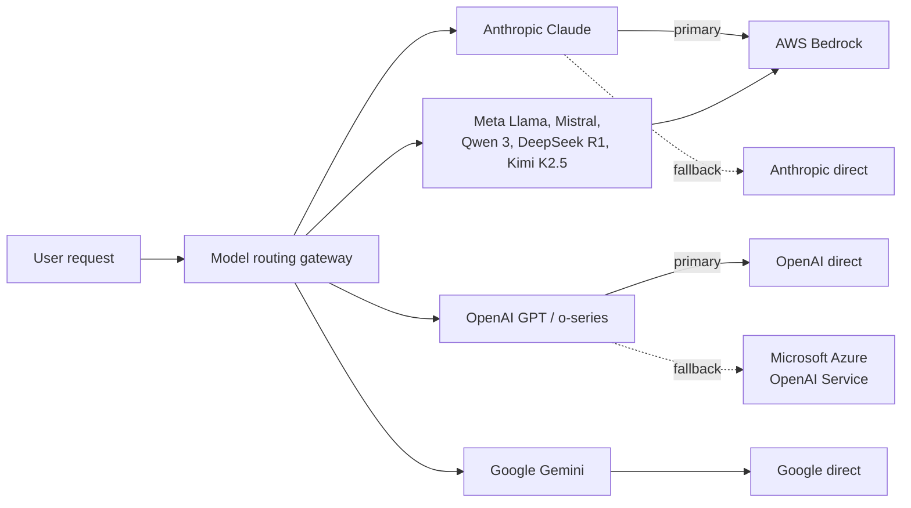

## Do users need to install any software to use Playlab?

No, Playlab is a web-based platform that runs in the browser. No additional software installation is required to use the core features of Playlab.

## What are the minimum system requirements for using Playlab?

For optimal performance, users should have:
- A relatively modern computer (less than 5 years old)
- A stable internet connection (minimum 5 Mbps)
- An updated web browser

Playlab can run on both desktop and laptop computers.

## What browsers does Playlab support?

Playlab supports the current and previous major versions of Chrome, Safari, Firefox, and Edge. For the best experience — especially when using voice input, voice output, or file uploads — we recommend staying on the latest release of your browser. Internet Explorer is not supported.

## Can Playlab be used on mobile devices?

Playlab is primarily designed for desktop and laptop computers. While some features may work on tablets and mobile, the full functionality is best experienced on a computer with a keyboard and mouse.

## Is there a limit to how many AI apps users can create?

Currently there are no limits on how many apps a user can build in Playlab.

## Does Playlab have rate limits?

Playlab pools capacity across multiple providers so most users never encounter limits during normal use. During unusual bursts of traffic — for example, a whole class running a heavy prompt at once — some requests may be slowed or retried against a fallback provider. Organizations with sustained high-volume needs should contact support@playlab.ai to discuss enterprise capacity.

## What file formats can be uploaded to Playlab?

Playlab supports common file formats including PDF, DOCX, TXT, JPG, PNG, and others. There may be file size limitations on the type of upload. See [Adding References](/getstarted/Adding%20References) for current format and size guidance.

## How can users share their AI apps?

Users can share their AI apps with others via direct links or by [publishing](/getstarted/publishing) them to their organization's workspace.

## Can I export my data or conversations from Playlab?

Yes. Builders can export app activity and conversations, and end users can export their own conversations. See [Exporting Data](/features/Exporting%20Data), [Exporting to Docx](/features/Exporting%20to%20Docx), and [Exporting to Google Drive](/features/Exporting%20to%20Google%20Drive) for the available formats and flows.

## How can users embed their Playlab app into a website, Canvas, or other LMS?

Embedding is only available to enterprise Playlab partners due to the increased usage and integration considerations involved. For broader sharing, users can share apps via direct links or publish them to their organization's workspace. See the [Partnerships FAQ](/faq/Partnerships) for details on integration options.

## Can users access Playlab offline?

No, Playlab requires an internet connection to function as it relies on cloud-based AI models for generating responses and processing inputs.

## How often is Playlab updated?

Playlab regularly updates its platform with new features and improvements. Major updates are typically announced via email to registered users and through the platform's notification system.

## Is this a ChatGPT wrapper?

No, Playlab is not just a ChatGPT wrapper. While it does support OpenAI models, it also supports models from Anthropic, Meta, Google, DeepSeek, Moonshot, Mistral, and Alibaba, allowing users to build on multiple different AI foundations.

## How can users control who has access to their AI apps?

Playlab provides permission settings that allow administrators to make their apps private, share them with specific individuals or groups within their organization, or make them publicly available within the Playlab community.

## Is Playlab Multimodal?

Yes. Playlab apps support image inputs, [voice input](/features/Voice%20Input), and [voice output](/features/Voice%20Output). We continue to expand our multimodal capabilities as the technology evolves.

## What LLMs does Playlab currently support?

Playlab supports more than a dozen AI models from multiple providers. Knowledge cutoff dates are noted in parentheses.

### Frontier Models
- **Anthropic**: Claude Opus 4.6 (Aug 2025), Claude Sonnet 4.6 (Aug 2025), Claude Haiku 4.5 (July 2025), Claude 4 Sonnet (Reasoning) (Aug 2025)
- **OpenAI**: GPT 5.4 (Aug 2025), GPT-5 Mini (Aug 2025)
- **Google**: Gemini 3.1 Pro (Jan 2025), Gemini 3 Flash (Jan 2025)

### Open Weight Models
- **Meta**: Llama 3.3 70B Instruct (Dec 2023), Llama 4 Maverick (Aug 2024), Llama 4 Scout (Aug 2024)
- **DeepSeek**: DeepSeek R1 (July 2024)
- **Moonshot**: Kimi K2.5 (~Apr 2024)
- **Mistral**: Mistral Large 3 (Oct 2024)
- **Alibaba**: Qwen 3 (Oct 2023)

New models are added regularly to provide users with access to the latest AI capabilities, with a focus on providing more open weight and eventually open source models for maximum flexibility and control.

## What are the context limits on each model?

Context limits vary by model and change over time as providers release new versions. Rather than duplicate that information here, we recommend checking the model provider's documentation (Anthropic, OpenAI, Google, etc.) for the current context window of any specific model. Playlab surfaces the full context window offered by the provider.

## Does Playlab support reasoning / thinking models?

Yes. Reasoning-capable models such as Claude 4 Sonnet (Reasoning) are available in the model picker and can be selected for apps that benefit from extended step-by-step thinking. See [Selecting an LLM](/features/Selecting%20an%20LLM) for guidance on choosing a model for your app.

## Where are Playlab's AI models hosted and how are requests routed?

Playlab does not train or host its own large language models. Instead, we integrate with third-party AI providers through enterprise cloud infrastructure that gives us stronger data controls, higher rate limits, and regional resilience than consumer API access would allow. Requests are routed through a managed gateway that applies automatic, transparent fallbacks if a primary provider is unavailable.

**Served via AWS Bedrock:**
- Anthropic Claude models (Claude 4.6 family, Claude Haiku 4.5)
- Meta Llama (Llama 3.3 70B Instruct, Llama 4 Scout, Llama 4 Maverick)
- Mistral Large 3
- Qwen 3
- DeepSeek R1
- Kimi K2.5

**Served via Microsoft Azure OpenAI Service** (fallback path for OpenAI models):
- GPT 5.4, GPT-5 Mini

**Accessed directly from the provider:**
- OpenAI GPT and o-series models (primary path; Azure is the fallback)
- Google Gemini (all models)

The general pattern is: **Anthropic → AWS Bedrock primary**, **OpenAI → OpenAI direct primary / Azure fallback**, with Google models going direct. Fallbacks are automatic and transparent to end users.

## Does Playlab support RAG?

Yes, builders can upload references for their Playlab apps to leverage. Uploaded files and references are protected. Other users cannot download them. Editors who have access to your app can see the files you have uploaded, but they cannot download the files or view what is inside of them. App users access parts of your references only through the app's responses, shaped by how they prompt it. We support files up to 30MB and allow websites to be referenced as well. See [Adding References](/getstarted/Adding%20References) for details.

## What's the difference between the Playlab apps and a custom made GPT or Gemini Gem?

Playlab apps offer more flexibility by supporting multiple AI models from different providers (OpenAI, Anthropic, Meta, Google, DeepSeek, Moonshot, Mistral, and Alibaba). Unlike custom GPTs which are limited to OpenAI's ecosystem or Gemini Gems which are limited to Google's ecosystem, Playlab allows you to create educational tools using various models and provides additional education-specific features and safeguards.

## Canvas LTI Integration

### Does Playlab offer Canvas LTI integration?

We are currently in beta phase and testing Canvas LTI integration with a few select partners. Our current implementation is based on LTI 1.1. This does not currently support deep linking to content but makes it easier to sign in and log on.

We are actively working on a broader release that will include LTI 1.3 support, which will provide enhanced functionality including deep linking capabilities. In the meantime, we are focusing our development efforts on improving how apps are organized and shared, evaluations, and making new interfaces available for people building apps on Playlab. Contact support@playlab.ai for the latest timeline on LTI 1.3 availability.

### Are there future integrations on the roadmap?

Yes, as a non-profit we are balancing which integrations to include. If you have suggestions please send them to support@playlab.ai