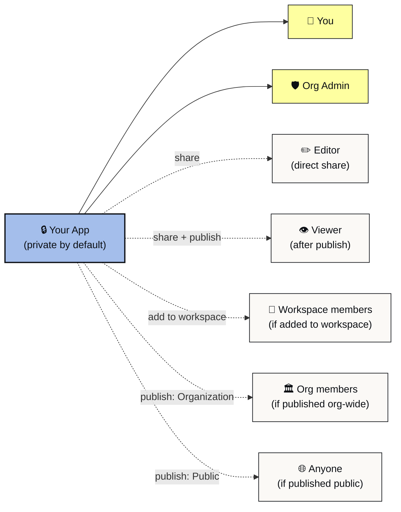

<Info>
  **Key points**

  - New apps start private to you and your org's admins
  - Sharing is an explicit action: Editor, Viewer, or add to a workspace
  - Org admins always see your apps for trust and safety oversight
</Info>

Every Playlab app starts private. Only you and your organization's admins can see it until you take action to share or publish. This page explains who can see what, why org admins still have visibility, and how to move from private to shared.

{/* IMG-06: Privacy indicator */}
<Frame caption="The lock icon on an app card shows the app is currently private.">
 
</Frame>

## Who can see your app

| Audience | Sees the app? | When |
| --- | --- | --- |
| You (the owner) | Always | From creation |
| Org admins of your organization | Always | For trust and safety oversight |
| People you have added as Editors | Yes | After you share |
| People you have added as Viewers | After publishing | Once you publish |
| Members of workspaces where you have added the app | Yes | After you add the app to that workspace |
| Other members of your organization | Only if visibility is Organization or Public | After you publish at that level |
| Anyone on Playlab | Only if visibility is Public | After you publish at that level |

*Yellow blocks see the app from creation. The rest open up only after you share, add, or publish.*

For details on publishing and visibility levels, see [Publishing your app in V2](https://learn.playlab.ai/features/Publishing).

## Going from private to shared

You have several ways to share an app, each with different reach:

**Share with one person.** Use the Share modal. They get Viewer or Editor access. See [Sharing with individuals](https://learn.playlab.ai/features/Sharing%20with%20Individuals).

**Share with a workspace.** Add the app to the workspace's Apps tab. Members of that workspace can use the app. See [Cross-workspace app use](https://learn.playlab.ai/features/Cross-Workspace%20App%20Use).

**Share with a group or organization.** Use the Share modal. The whole group or org gets Viewer access. See [Sharing with groups and orgs](https://learn.playlab.ai/features/Sharing%20with%20Groups%20and%20Orgs).

**Publish broadly.** Set visibility to Organization or Public. See [Publishing](https://learn.playlab.ai/features/Publishing).

You can combine these. An app can be Public and also shared with specific Editors in your org. The most permissive setting wins.

## Why org admins still see your app

Org admins have always-on visibility for trust and safety reasons. If a student conversation in any app is flagged, an admin needs to be able to find the conversation, the app it came from, and the people involved.

For most builders, the practical effect is small. The admin sees the app in their org-level dashboard. They do not get notified when you create or edit it.

{/* IMG-07: Workspace permissions panel */}
<Frame caption="A workspace view with the Your permissions panel open. Each member sees what they can build, share, and manage in this workspace.">
 
</Frame>

Admin visibility is read-only. They can view the app but not edit it. They cannot publish your app or change who has access.

## FAQ

<AccordionGroup>
 <Accordion title="Can I make my app fully private, hidden from org admins?">
 No. Org admins keep visibility for trust and safety. The default is private from peers and members of your workspaces unless you share or publish.
 </Accordion>
 <Accordion title="Can I see who has accessed my app?">
 Yes. Activity views show usage per app, including who used it and when. See [Reviewing student activity per class](https://learn.playlab.ai/getstarted/Reviewing%20Activity).
 </Accordion>
 <Accordion title="Does private mean no one but me can find it through search?">
 Yes. Private apps do not appear in any search outside the owner's view and the org admin's dashboard.
 </Accordion>
  <Accordion title="Can I download a list of who has access to my app?">
    Yes. From the Share modal, click Export. You get a CSV of every individual, group, and organization with access, plus their permission level.
  </Accordion>
  <Accordion title="If I delete an app, what happens to people who had access?">
    They lose access immediately. The app and its conversations are removed. Activity history is retained for compliance, visible only to org admins.
  </Accordion>
  <Accordion title="Does setting an app private remove existing conversations?">
    No. Conversations are preserved. Privacy controls future access, not past records.
  </Accordion>
</AccordionGroup>

---

Last updated: 2026-05-05

Contact us at [support@playlab.ai](mailto:support@playlab.ai)
