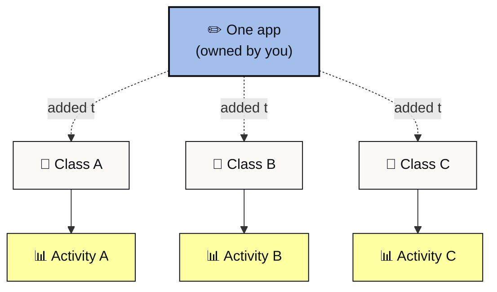

{/* TODO-VID-CROSS-WORKSPACE: Walkthrough video for using one app in many classes */}
<Frame caption="Walkthrough: using one app in many classes.">
  <iframe
    src="https://www.loom.com/embed/TODO-VID-cross-workspace"
    frameborder="0"
    webkitallowfullscreen=""
    mozallowfullscreen=""
    allowfullscreen=""
    style={{ width: "100%", height: "400px" }}
  ></iframe>
</Frame>

You can add the same app to as many workspaces as you need. The app keeps a single owner and source of truth. Activity stays segmented by workspace, so each class sees only its own. When the owner publishes an update, every class using the app sees the new version.

The app exists once. You add it to a workspace as a reference, and the workspace gets a tile for it. Members of the workspace can use the app, and their activity is recorded against that workspace. The app's source stays under the original owner.

## How to add an app to a workspace

<Steps>
 <Step title="Go to the workspace">
 Open the workspace where you want the app available.
 </Step>
 <Step title="Open the Apps tab">
 The tab lists apps already in the workspace and a button to add more.
 </Step>
 <Step title="Click Add Apps">
 The Add Apps modal opens with a search field and a list of apps you have access to.
 </Step>
 <Step title="Select an existing app">
 Pick the app from the list or search by name. Apps from your org, apps shared with you, and apps in Collections you have access to all appear here.
 </Step>
 <Step title="Confirm">
 The app shows up in the workspace's Apps tab. Members can use it from their dashboard.
 </Step>
</Steps>

{/* IMG-10: Add Apps modal in workspace */}
<Frame caption="From the Apps tab, click Add Apps to bring an existing app into the workspace.">
 
</Frame>

To add the same app to another workspace, go to that workspace and repeat the steps.

## Activity is segmented per class

Each workspace where the app is added keeps its own activity log. A teacher running three sections of the same class sees three separate activity views, one per workspace. Org admins can see across workspaces, but teachers stay scoped to their classes.

*One app, three classes, three separate activity views. Each teacher sees only their class.*

For more, see [Reviewing student activity per class](https://learn.playlab.ai/getstarted/Reviewing%20Activity).

## Updates propagate automatically

When the app's owner publishes a new version, every workspace using the app sees the update on the next load. Conversations from prior versions are preserved. New conversations use the latest version.

This is the biggest reason cross-workspace use replaced remixing for most teachers. A small fix or a curriculum update no longer needs to be copied into ten places.

## When to remix anyway

Cross-workspace use covers most cases. Remixing still makes sense in a few:

**Heavy customization.** If you want to substantially change the prompt, references, or starter inputs for one class, remix. The original app stays clean.

**Frozen-in-time pedagogy.** If you want a class to use the app exactly as it was at a point in time, even if the owner ships updates, remix. Your copy is independent.

**Learning the prompt.** Students learning to build apps often remix as a way of seeing how an app is built. The remix is for teaching, more than for production deployment.

For most other cases, adding the app to the workspace is the simpler path.

## FAQ

<AccordionGroup>
 <Accordion title="Can students see each other across classes?">
 No. Each workspace's activity is visible only to its own members and managers, plus org admins. A student in section A does not see what a student in section B is doing with the same app.
 </Accordion>
 <Accordion title="Does this replace remixing entirely?">
 For deployment, mostly. For pedagogy and customization, no. Remixing is still useful for the cases above.
 </Accordion>
 <Accordion title="Who sees the activity?">
 Workspace members can see their own activity. Workspace managers see all activity inside the workspace. Org admins see activity across all workspaces in the org. Cross-workspace patterns require admin access.
 </Accordion>
 <Accordion title="What if the original app is unpublished or deleted?">
 Workspaces using the app see a "no longer available" state. Activity history is preserved. The workspace owner can remove the tile or wait for the original app to come back online.
 </Accordion>
 <Accordion title="Can I remove the app from a workspace later?">
 Yes. From the Apps tab, click the app and choose **Remove from Workspace**. The app is no longer available in that workspace. Activity stays in the workspace's history. The original app is unaffected.
 </Accordion>
  <Accordion title="If I update the app, do all classes get the update at the same time?">
    Yes. The next time anyone opens the app in any workspace, they see the latest version.
  </Accordion>
  <Accordion title="Can I unlink an app from a workspace later?">
    Yes. From the workspace's Apps tab, click the app and choose Remove from Workspace. The original app and its other locations are unaffected.
  </Accordion>
  <Accordion title="Does cross-workspace use count against any quota?">
    No. Adding an existing app to a workspace doesn't count toward your workspace's app limit. Only apps you create count.
  </Accordion>
</AccordionGroup>

---

Last updated: 2026-05-05

Contact us at [support@playlab.ai](mailto:support@playlab.ai)
