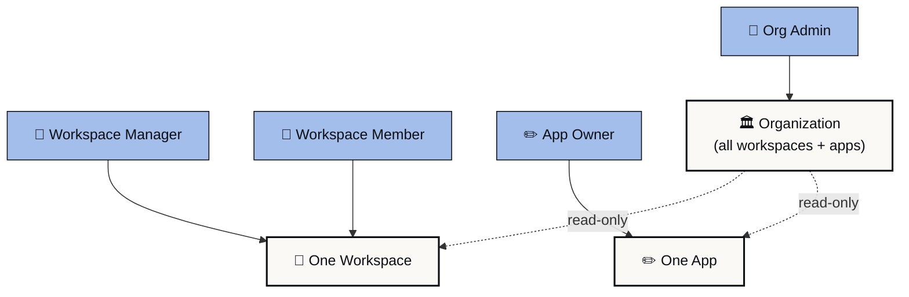

This page documents the org-level role matrix. For workspace-level roles, see [Adding members to a workspace](https://learn.playlab.ai/getstarted/Adding%20Members%20to%20your%20Workspace) and [Creating a workspace](https://learn.playlab.ai/getstarted/Creating%20Your%20Own%20Workspace).

<Info>
 Role names may shift between this draft and launch. Confirm with your org admin if a name does not match what you see in the product.
</Info>

## Roles in your org

A Playlab organization has four roles.

**Admin**

The highest level of access. Admins manage the org: invite members, change roles, configure org settings, see all activity, see all flagged messages, and manage workspaces. Most orgs have two to four Admins.

**Manager**

Workspace-level leadership. Managers can create and manage workspaces, invite people to those workspaces, and review activity inside the workspaces they manage. They do not have the org-wide visibility that Admins have.

**Member**

The default role. Members can join workspaces they are invited to, use apps in those workspaces, and (depending on workspace building permissions) build their own apps. Members do not have admin or workspace-management capabilities.

**Viewer**

Read-only access at the org level. Useful for instructional coaches, partner observers, or auditors who need to see what is happening without participating. Viewers can be added to workspaces with their own workspace-level role.

## How to change a member's role

<Steps>
 <Step title="Go to the org Members tab">
 From the org dashboard, click Members. You see all org members with their current roles.
 </Step>
 <Step title="Find the member">
 Search by name or scroll. Click the member to open their detail panel.
 </Step>
 <Step title="Change the role">
 The role dropdown shows the four roles. Pick the new role.
 </Step>
 <Step title="Confirm">
 The change applies immediately. The member's permissions update on their next page load.
 </Step>
</Steps>

{/* IMG-22: Role dropdown in Members tab */}
<Frame caption="The role dropdown on a member's detail panel. Pick the role and the change applies immediately.">
 
</Frame>

## Permission inheritance

Permissions in V2 cascade from org to workspace to app. Each level grants access to what's inside it, with one exception (apps follow their owner, not the workspace).

**Org Admin** has read access to every workspace and every app in the org, regardless of explicit invites. This is the trust and safety layer.

**Workspace Manager** has full access inside the workspace they manage. They do not get org-wide access from this role alone.

**Workspace Member** has access to the workspace they were invited to. App-level permissions are set per app.

**App owner** keeps control of their app, even if their workspace role changes. Removing a person from a workspace does not transfer their apps. Apps follow their owner.

For trust and safety: an Org Admin always has visibility into every app, workspace, and conversation in the org, including private apps. This is documented in [App privacy and visibility](https://learn.playlab.ai/features/App%20Privacy%20and%20Visibility).

## Best practices

Useful patterns for org admins:

Keep Admin count small. Two to four for most orgs. Each Admin can do everything; large numbers make accountability harder.

Use Manager for teacher leads or department heads. Workspace creation and management without org-wide visibility.

Default new joiners to Member. Upgrade as needed. Walking back access is harder.

Review roles every semester. Past staff, departed coaches, and former co-admins often retain access longer than they should.

## FAQ

<AccordionGroup>
 <Accordion title="Can I create custom roles?">
 Not in this release. The four roles cover the cases V1 supported. Custom role definition is on the roadmap.
 </Accordion>
 <Accordion title="How do roles cascade across orgs in cross-org sharing?">
 When you share an app or Collection with another org, permissions are scoped to that share. The recipient org's roles do not transfer to your org. Members of the recipient org gain access only at the level you granted in the share.
 </Accordion>
 <Accordion title="Are roles different for SSO orgs?">
 The role structure is the same. Some orgs sync role changes from their identity provider; others manage roles directly in Playlab. Check with your org admin.
 </Accordion>
 <Accordion title="Can I bulk-change roles?">
 Yes. From the Members tab, select multiple members with checkboxes and apply a role change to all of them. Useful for end-of-year cleanups.
 </Accordion>
 <Accordion title="What happens to apps when a member's role is downgraded?">
 The apps stay with the original owner. Role changes affect what the member can do going forward. They do not transfer or delete existing apps.
 </Accordion>
</AccordionGroup>

---

Last updated: 2026-05-05

Contact us at [support@playlab.ai](mailto:support@playlab.ai)
