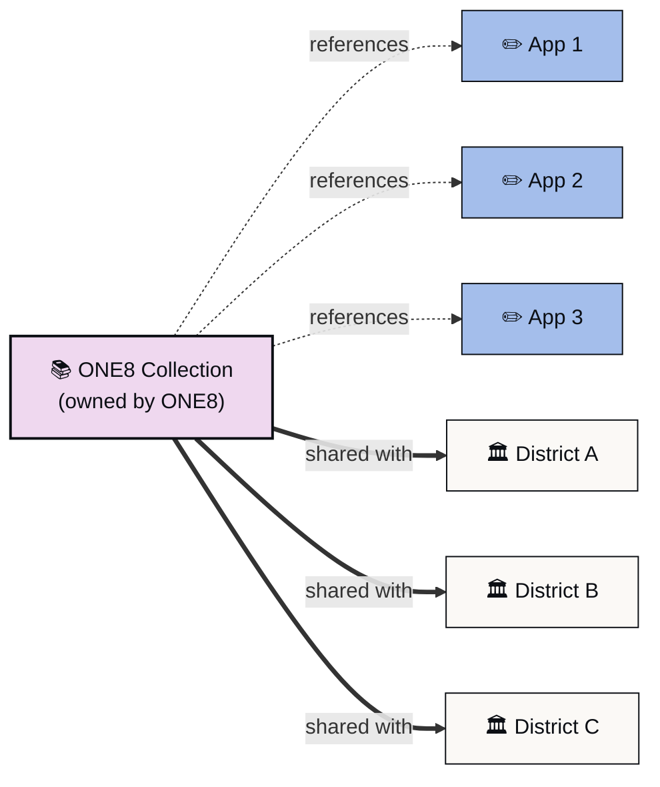

*A curated set of apps you can share like a single resource.*

A Collection in Playlab V2 is a bundle of apps you put together, name, and share. Think of it like a playlist for apps. You build a Collection once, add the apps you want included, and share the whole thing with a person, a group, or an entire organization. When you update an app inside the Collection, every recipient sees the update.

{/* IMG-13: Collections tab on org */}
<Frame>
  
</Frame>

## What is a Collection

A Collection holds references to apps. The apps themselves keep their owners and live in their original workspaces. The Collection is a way to group them and share them as a unit.

If you have used a music streaming service, the analogy works: an album is a fixed set of songs by one artist; a playlist is a curated set you assembled. Apps are like songs. Collections are like playlists.

A few properties:

A Collection has a name and a description. You set both when you create it.

A Collection has an owner. By default, the person who created it.

A Collection holds apps you have access to. You can add your own apps and apps that have been shared with you.

A Collection can be shared with individuals, groups, or organizations using the same Share modal that works on apps.

When you update an app inside a Collection, the change propagates. Recipients see the new version on their next visit.

## When to use a Collection

Collections solve a problem that came up often in V1: a partner organization wants to give a curated bundle of apps to many districts, schools, or teachers, and they want updates to flow without having to redistribute.

Common cases:

**Starter packs.** A Learning Partner gives a new partner district a Collection of seven onboarding apps so teachers have a known starting point.

**Curriculum sets.** A curriculum org bundles the apps that go with a unit and shares the Collection with each adopting school.

**Department resources.** A district admin builds a Collection of math apps and shares it with the math department across all schools.

**Pilot bundles.** An R&D team curates the apps that are part of a pilot and shares the Collection with the pilot teachers.

## ONE8 story

ONE8 Foundation works with Massachusetts districts on AI in education. Their V1 deployment workflow involved remixing dozens of apps across many partner orgs, with each district managing a separate copy. When ONE8 updated an app, the change had to propagate manually.

In V2, ONE8 builds a Collection of those apps once. Partners add the Collection to a workspace, and the apps are available in the workspace. ONE8 sees aggregate activity across the network. Each district sees only its own. When ONE8 publishes an update to one of the apps, every classroom using it sees the new version.

*One Collection, three apps, three districts. ONE8 updates an app once and every district sees the new version.*

This is the canonical Collections workflow. It is what V2 sharing was designed for.

## Collections vs workspaces vs apps

| Container | What it holds | Who owns it | Activity |
| --- | --- | --- | --- |
| App | One app's prompt, references, and conversations | One person | Per app, segmented by where it is used |
| Workspace | Members and apps for a class or team | Workspace owner / org | Per workspace |
| Collection | A curated set of apps for sharing | Collection creator | Aggregate across recipient orgs |

Collections do not contain conversations or members. They contain apps. The apps inside a Collection still live in their original workspaces and keep their original owners. The Collection is a sharing wrapper.

## Next: how to create one

For the create-and-share walkthrough, see [Creating and sharing a Collection](https://learn.playlab.ai/features/collections/Creating%20and%20Sharing%20a%20Collection).

## FAQ

<AccordionGroup>
  <Accordion title="Can I add other people's apps to a Collection?">
    You can add any app you have access to. That includes apps shared with you with sufficient permissions. The original owner is unchanged. If they unshare with you, the app drops out of your Collection.
  </Accordion>
  <Accordion title="Do Collections expire?">
    No. Collections persist until you delete them. Apps inside the Collection persist as long as the original app exists.
  </Accordion>
  <Accordion title="Can a Collection contain Collections?">
    Not in this release. A Collection contains apps. If you need a hierarchy, group apps into multiple Collections and share each.
  </Accordion>
  <Accordion title="How is a Collection different from a workspace?">
    A workspace holds members, apps, and activity for a class or team. A Collection is a sharing bundle. Members of a workspace use apps together. Recipients of a Collection get a curated set to use however they want, in their own workspaces.
  </Accordion>
  <Accordion title="Who sees activity for apps inside a Collection?">
    Activity rolls up to the app's owner. The Collection creator sees aggregate usage of the apps in the Collection. Each recipient org sees only its own activity.
  </Accordion>
</AccordionGroup>

---

Last updated: 2026-05-05

Contact us at [support@playlab.ai](mailto:support@playlab.ai)
