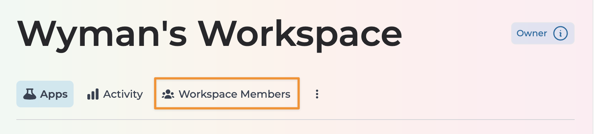
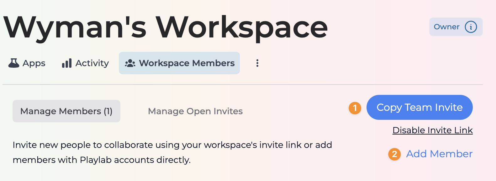
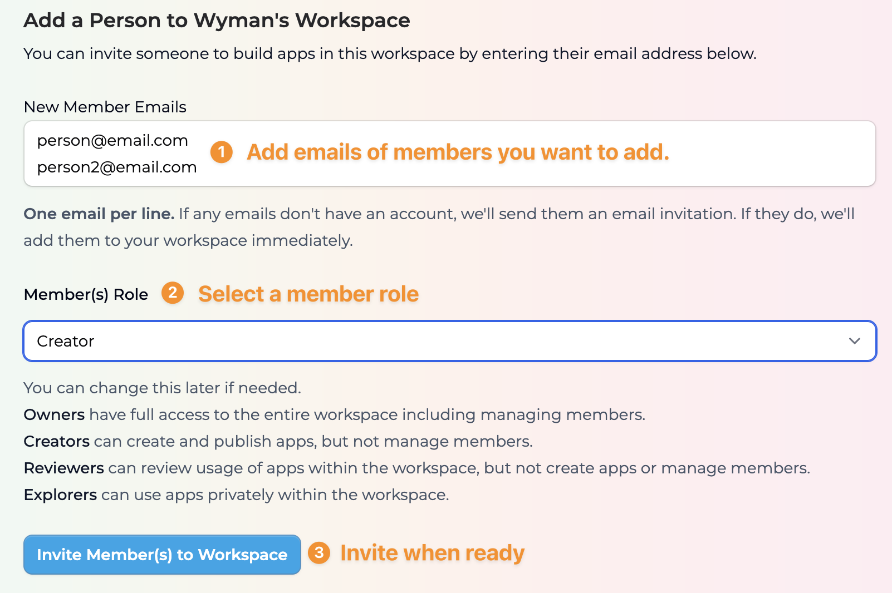

In Playlab, workspaces allow you to collaborate with team members on building and managing apps. This guide will walk you through the process of adding members to your workspace, managing their roles, and organizing your team effectively.

<Info>
  **Proper Permissions Matter**
  
  Assigning the right roles to your team members ensures they have appropriate access to workspace resources. Always double-check that you're assigning the correct permission level based on each person's responsibilities.
</Info>

## <Icon icon="video" size="24" className="inline-block align-text-bottom" /> Watch How to Add Members to Your Workspace

Watch a short video demonstrating how to add members to your Playlab workspace.
  <iframe
    src="https://www.loom.com/embed/4c6814db707444be859f402a0d29671d?sid=fb736df7-e7fa-43af-9341-3fbf9b0fdede"
    frameborder="0"
    webkitallowfullscreen
    mozallowfullscreen
    allowfullscreen
    style={{ width: "100%", height: "400px" }}
  ></iframe>
  <figcaption>Watch how to add members to your workspace [2:43]</figcaption>

## <Icon icon="stairs" size="24" className="inline-block align-text-bottom" /> Adding Members Process

<Steps>
  <Step title="Access Workspace Members">
    **Navigate to your workspace members section.**
    
    1. From your workspace dashboard, locate and click the **Workspace Members** tab
      <Frame>
      
    </Frame>
    2. This will show you an overview of current members and their roles
    3. You'll also see options for managing members
  </Step>

  <Step title="Choose Your Invitation Method">
    **Decide how you want to invite new team members.**
    
    You have two main options for adding members to your workspace:
    <Frame>
      
    </Frame>
    - **1. Copy Team Invite:** Generate a shareable link to send to multiple people
    - **2. Add Member:** Directly invite specific individuals by email
  </Step>

  <Step title="Using the Copy Team Invite Method">
    **Share an invitation link with your team.**
    
    1. Click the **Copy Team Invite** button in the upper right corner
    2. The system will generate a unique invitation link
    3. Share this link via email, messaging apps, or any communication channel
    4. Recipients can click the link to join your workspace
    
    <Warning>
      **Remember:** Invitation links expire after 7 days. If someone hasn't used the link by then, you'll need to generate a new one.
    </Warning>
  </Step>

  <Step title="Using the Add Member Method">
    **Invite specific individuals by email.**
        <Frame>
      
    </Frame>
    1. Click the **Add Member** button
    2. In the dialog that appears, enter email addresses in the input field
    
    <Warning>
      **One email per line.** If adding multiple members, enter each email address on a separate line.
    </Warning>
    
    3. Select the appropriate role for the new member(s) from the dropdown
    4. Click **Invite Member(s) to Workspace** to send the invitations
    5. If recipients already have Playlab accounts, they'll be added immediately
    6. If not, they'll receive email invitations to create accounts
  </Step>

  <Step title="Managing Member Roles">
    **Assign appropriate permission levels.**
    
    When adding members, you'll need to assign them one of the following roles:
    
    - **Owners:** Have full access to the entire workspace including managing members
    - **Creators:** Can create and publish apps, but not manage members
    - **Reviewers:** Can review usage of apps within the workspace, but not create apps or manage members
    - **Explorers:** Can use apps privately within the workspace
    
    Choose roles carefully based on each person's responsibilities in your team.
  </Step>

  <Step title="Managing Existing Members">
    **View and modify your current team.**
    
    1. The Workspace Members section shows all current members
    2. You can see each person's role at a glance
    3. To change a member's role, locate the role dropdown next to their name
    4. To remove a member, use the remove option next to their name
    
    <Warning>
      **Admin Restrictions:** Only workspace owners (admins) can add or remove members and change roles.
    </Warning>
  </Step>
</Steps>

## <Icon icon="lightbulb-on" size="24" className="inline-block align-text-bottom" /> Workspace Collaboration Best Practices

When managing your workspace members, keep these tips in mind:

  - **Limit owner roles** to those who truly need full administrative access
  - **Regularly review member roles** to ensure they align with current responsibilities
  - **Remove inactive members** to maintain workspace security
  - **Use descriptive workspace names** to help members identify the right workspace
  - **Communicate role changes** to team members before making adjustments
  - **Consider workflow patterns** when assigning roles to ensure efficient collaboration
  - **Create separate workspaces** for distinctly different projects or teams if needed
  - **Document your role structure** so team members understand permission levels

## <Icon icon="circle-question" size="24" className="inline-block align-text-bottom" /> Frequently Asked Questions

<Accordion title="What's the difference between using the invite link and adding members directly?">
  **Invite Link:** Creates a general access link that multiple people can use to join your workspace with the same role. This is convenient for adding many members at once who will have the same permissions.
  
  **Adding Members Directly:** Allows you to specify exact email addresses and customize the role for each person. This is better for precision control over who joins and what they can do.
  
  Both methods get people into your workspace, but direct addition gives you more granular control.
</Accordion>

<Accordion title="Can I change a member's role after they've joined?">
  Yes, workspace owners can change member roles at any time. Simply:
  
  1. Go to the Workspace Members section
  2. Find the member whose role you want to change
  3. Use the role dropdown next to their name to select a new role
  4. The change takes effect immediately
  
  The member will have access to whatever the new role allows as soon as the change is made.
</Accordion>

<Accordion title="Is there a limit to how many members I can add to my workspace?">
  The number of members you can add depends on your Playlab plan. Different subscription tiers have different member limits. Check your current plan details for specific information about your member allowance.
</Accordion>

<Accordion title="What happens if I remove a member from my workspace?">
  When you remove a member:
  
  - They immediately lose access to the workspace
  - Their contributions remain (apps they created stay in the workspace)
  - They can no longer view or interact with any apps in the workspace
  - They'll need a new invitation if you want to add them back later
  
  Removal is not the same as changing their role to a more restricted one - it completely revokes their access.
</Accordion>

<Accordion title="Can I batch upload members from a spreadsheet?">
  Currently, Playlab does not support batch uploading members from spreadsheets or CSV files. You'll need to add members either by:
  
  - Sharing the invitation link with multiple people
  - Manually entering email addresses (one per line) when using the Add Member function
  
  We're continually improving our platform, so batch upload functionality may be added in future updates.
</Accordion>

<Accordion title="Do members need to create Playlab accounts to join my workspace?">
  Yes, all workspace members need Playlab accounts. If you invite someone who doesn't have an account:
  
  1. They'll receive an email invitation
  2. The email will include a link to create their account
  3. Once their account is created, they'll automatically join your workspace
  4. They'll have the permissions assigned to them in your invitation
  
  If they already have a Playlab account, they'll be added to your workspace immediately.
</Accordion>

## <Icon icon="bullhorn" size="24" className="inline-block align-text-bottom" /> Need Support?

If you encounter any issues while adding or managing workspace members:

* Contact us at [support@playlab.ai](mailto:support@playlab.ai)

Last updated: March 26, 2025