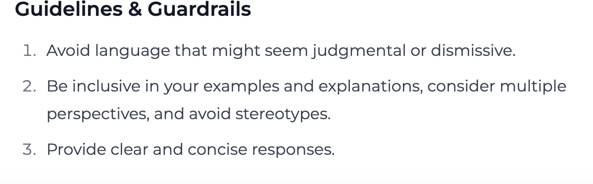

Creating safe, fair, and responsible AI applications requires implementing proper guardrails, following development guidelines, and actively mitigating bias. This guide will help you build Playlab apps that are both powerful and trustworthy for all users.

<Warning>
  **Safety is Non-Negotiable**
  
  Unsafe AI applications can lead to real-world harm! To create responsible apps, you must:
  - Implement appropriate guardrails to prevent misuse
  - Follow established guidelines for responsible development
  - Actively identify and mitigate potential biases
  - Test your app thoroughly across diverse scenarios
  - Monitor app usage for safety issues
</Warning>

## <Icon icon="helmet-safety" size="24" className="inline-block align-text-bottom" /> Default Guidelines and Guardrails

By default, every Playlab builder template includes the following Guidelines and Guardrails.

<Frame>
  
  <figcaption>Default Guidelines and Guardrails in Playlab</figcaption>
</Frame>

<Note>
  **Customizable Starting Point**
  
  These default guidelines and guardrails are just a starting point. **You can and should add more guidelines and guardrails** specific to your app's purpose, audience, and risk profile.
</Note>

---

## <Icon icon="lightbulb-on" size="24" className="inline-block align-text-bottom" /> Best Practices for Safe Development

Follow these principles to enhance the safety of your Playlab apps:

<CardGroup cols={2}>
  <Card title="What You Can Do" icon="circle-check" iconType="duotone" color="#0f766e">
    **Yes, you can and should add more guardrails and guidelines** specific to your use case:
    
    - **Add domain-specific safety checks** relevant to your app's purpose
    - **Test your app with diverse user personas** to uncover potential issues
    - **Add clear usage guidelines** in your app's design tab or prompt instructions
    - **Include transparent explanations** about your app's capabilities and limitations
    - **Provide exemplar responses** that show the AI what good outputs look like for your specific use case
  </Card>

  <Card title="What to Avoid" icon="circle-xmark" iconType="duotone" color="#be123c">
    **Don't compromise safety for convenience** when building your app:
    
    - **Never remove default guardrails** without careful consideration and alternatives
    - **Avoid overly broad app instructions** that could invite misuse
    - **Don't rush testing** before publishing your app
    - **Avoid assuming all users share your perspective** or background
    - **Don't ignore edge cases** in your safety planning
    - **Never publish an app without safety testing** across multiple scenarios
  </Card>
</CardGroup>

---

## <Icon icon="thought-bubble" size="24" className="inline-block align-text-bottom" /> Questions to Ask While Building

Ask yourself these questions to develop empathy-centered, safe applications:

<Accordion title="User Understanding">
  **Consider the diverse perspectives of your potential users and demonstrate empathy.**
  
  1. Who are all the different types of people who might use this app?
  2. How might users with different backgrounds interpret instructions or outputs?
  3. What accessibility considerations should I address?
  4. How would I feel if I received this output as a user?
  5. Am I considering cultural differences in how information is perceived?
</Accordion>

<Accordion title="Safety Assessment">
  **Evaluate potential risks in your application.**
  
  1. What is the worst way someone could misuse this app?
  2. Are there scenarios where my app could unintentionally cause harm?
  3. How will I handle edge cases or unexpected inputs?
  4. Have I tested with adversarial examples?
  5. What safety mechanisms beyond the defaults would benefit my specific use case?
</Accordion>

<Accordion title="Fairness Check">
  **Evaluate potential biases in your application.**
  
  1. Does my app treat all user groups equitably?
  2. Are my reference materials diverse and representative?
  3. Have I tested scenarios across different demographics?
  4. Am I inadvertently encoding assumptions in my prompts?
  5. What metrics will I use to measure fairness?
</Accordion>

## <Icon icon="circle-question" size="24" className="inline-block align-text-bottom" /> Frequently Asked Questions

<Accordion title="Can I modify the default guardrails?">
  You can add additional guardrails to enhance safety, but we strongly recommend against removing or weakening the default protections. These defaults have been carefully designed to prevent common misuse scenarios.
  
  If you believe a default guardrail is interfering with legitimate use cases, you can revise them for your context.
</Accordion>

<Accordion title="How do I know if my app needs additional guardrails beyond the defaults?">
  Consider these factors when evaluating the need for additional guardrails:
  
  - The sensitivity of your app's domain (healthcare, finance, education, etc.)
  - Whether your app processes or generates personal information
  - If your app could influence high-stakes decisions
  - The diversity of your expected user base
  - Any domain-specific risks unique to your application
  
  When in doubt, it's better to implement additional safeguards than to discover safety issues after launch. Remember that you can always add more guardrails and guidelines - the defaults are just a starting point.
</Accordion>

<Accordion title="What's the difference between guidelines and guardrails?">
  Guidelines are instructional elements that guide the AI's behavior through natural language direction. They influence how the model responds but don't enforce hard boundaries.
  
  Guardrails are technical mechanisms that detect and prevent specific behaviors or outputs. They act as safety filters that can block harmful inputs or outputs regardless of the model's initial response.
  
  An effective safety approach combines both: guidelines to shape behavior and guardrails to enforce firm boundaries.
  
  **Pro Tip:** Including exemplar responses or sample outputs within your guidelines shows the AI what a strong response looks like in context. This teaches the model your preferred style, tone, and content boundaries more effectively than abstract instructions alone.
</Accordion>

<Accordion title="How can I test if my guardrails are working properly?">
  Test your guardrails with these approaches:
  
  - Create a set of "red team" test cases designed to probe boundaries
  - Try variations of prohibited requests to check for consistency
  - Test edge cases that might fall in gray areas
  - Have others attempt to use your app in ways you didn't intend
  - Document both successful guardrail activations and any bypasses discovered
</Accordion>

<Accordion title="What should I do if users complain about guardrails blocking legitimate use?">
  When users report legitimate uses being blocked:
  
  1. Document the specific scenario in detail
  2. Evaluate whether it represents a true false positive
  3. Consider if you can refine guardrails to be more precise rather than less restrictive
  4. Explain to users why safety measures exist, even if they can sometimes cause inconvenience
  5. If needed, create alternative paths for legitimate edge cases
  
  Remember that some friction is acceptable if it prevents significant harms.
</Accordion>

## <Icon icon="bullhorn" size="24" className="inline-block align-text-bottom" /> Need Support?

If you encounter any issues or have questions about responsible AI development:

* Contact us at [responsible-ai@playlab.ai](mailto:responsible-ai@playlab.ai)
* Join the [Playlab Community Slack](https://join.slack.com/t/playlabcommunity/shared_invite/zt-31mhwj7nl-49e1Mw5fYpyHJGOFyDIFtA) and check out the Responsible AI channel

<CardGroup>
  <Card title="Back to Getting Started" icon="arrow-left" href="/getstarted/Getting Started" iconType="duotone">
    Go back to the beginning
  </Card>
  <Card title="FAQ" icon="magnifying-glass" href="/about/FAQ" iconType="duotone">
    Find answers in our FAQ
  </Card>
</CardGroup>

Last updated: March 21, 2025