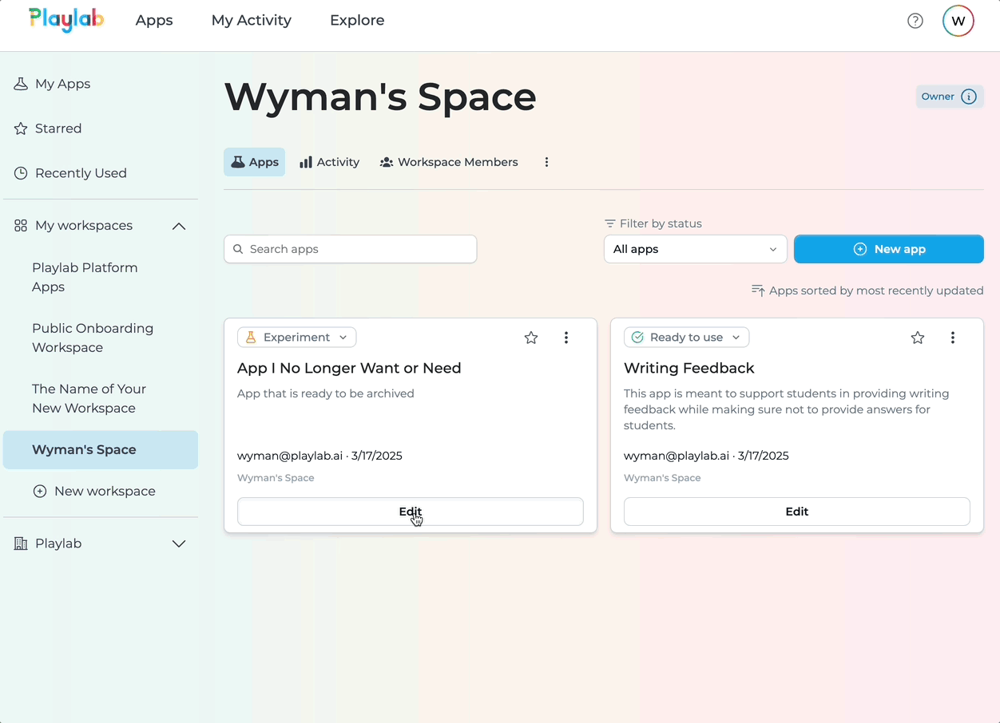
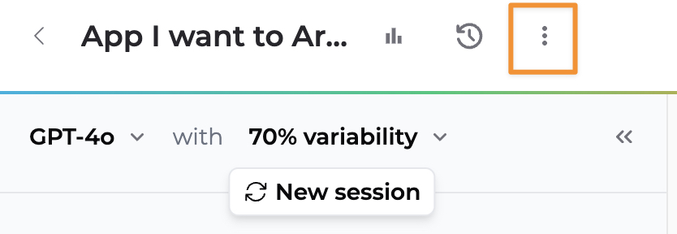
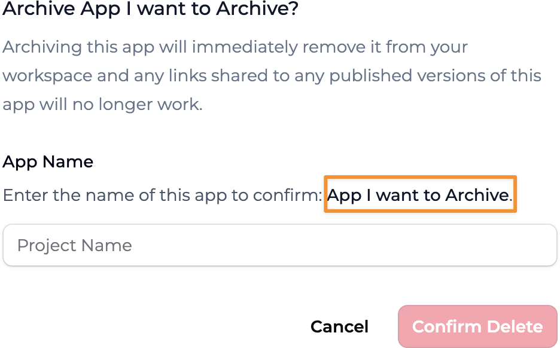
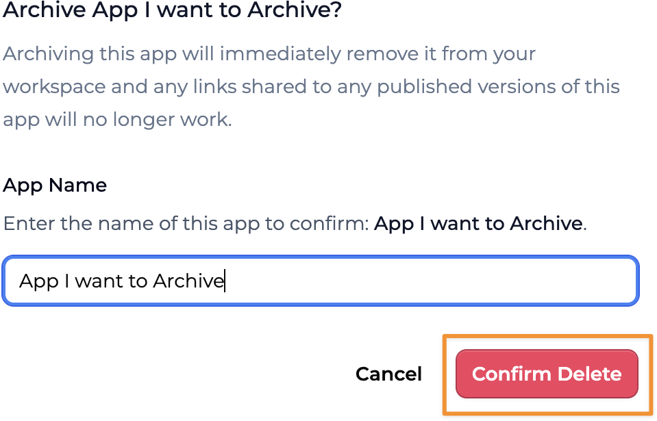

When you no longer need an app or want to remove it from your workspace, in Playlab we call it **Archiving** your app. This guide will show you how to properly manage your Playlab apps when they're no longer needed.

<Warning>
  **Permanent Action**
  
  Archiving an app is a permanent action. Once archived, an app cannot be recovered. Make sure you want to proceed before confirming.
</Warning>

## <Icon icon="video" size="24" className="inline-block align-text-bottom" /> Watch How to Delete or Archive Your Playlab App

Watch a short clip of how to archive a Playlab app.

<Frame>
  
  <figcaption>Archiving a Playlab App</figcaption>
</Frame>

---

## <Icon icon="arrow-right" size="24" className="inline-block align-text-bottom" /> Follow these steps to archive an app:

<Steps>
  <Step title="Navigate to Your App">
    **Locate the app you want to archive in your workspace.**
    
    1. Go to your Playlab workspace
    2. Find the app you want to archive
    3. Click **Edit** to access the app
  </Step>

  <Step title="Access Archive Option">
    **Use the app options menu to find the archive function.**
    
    1. Click the **three-dot menu (⋮)** on the app card
    
    <Frame>
      
    </Frame>
    
    2. Select **Archive** from the dropdown menu
    
    <Frame>
      
    </Frame>
  </Step>

  <Step title="Confirm Deletion">
    **Verify the deletion by typing the app name.**
    
    1. Type in the case-sensitive name of your app in the text field
    2. The **Confirm Delete** button will become clickable only when the app name is entered correctly
    
    <Frame>
      
    </Frame>
    
    3. Click on **Confirm Delete** to permanently remove the app from your workspace
  </Step>
</Steps>
---

## <Icon icon="lightbulb-on" size="24" className="inline-block align-text-bottom" /> App Management Best Practices

Consider these recommendations when managing your Playlab apps:

- **Export important data** before archiving an app
- **Communicate with team members** before deleting shared apps
- **Create a backup** by remixing the app if you might need it later
- **Document key features** of apps before deletion for future reference
- **Review app usage** to determine if it's truly no longer needed

## <Icon icon="circle-question" size="24" className="inline-block align-text-bottom" /> Frequently Asked Questions

<Accordion title="Is app archiving permanent?">
  Yes, archiving an app permanently removes it from your workspace. This action cannot be undone. Make sure you're certain about deleting the app before proceeding with archiving.
  
  If you think you might need the app in the future, consider remixing it first as a backup.
</Accordion>

<Accordion title="What happens to shared apps when I archive them?">
  When you archive a shared app, it's removed for all users who have access to it. Make sure to communicate with your team before deleting shared resources.
  
  Team members will no longer be able to access, use, or modify the app after it has been archived.
</Accordion>

<Accordion title="Can I recover an archived app?">
  Currently, you cannot recover an archived Playlab app. Archiving is a permanent action, and there is no built-in recovery process.
  
  This is why it's important to be certain before proceeding with archiving any app.
</Accordion>

<Accordion title="Will archiving an app free up storage space?">
  Yes, archiving apps helps maintain a clean workspace and can free up storage allocated to your account. This can be especially helpful if you have many unused apps taking up space.
</Accordion>

<Accordion title="Can I archive multiple apps at once?">
  No, you must archive apps individually. There is currently no batch archiving feature. You'll need to go through the archive confirmation process for each app separately.
</Accordion>

<Accordion title="Is there a limit to how many apps I can archive?">
  There is no limit to the number of apps you can archive. You can archive as many apps as needed to keep your workspace organized and manageable.
</Accordion>

## <Icon icon="bullhorn" size="24" className="inline-block align-text-bottom" /> Need Support?

If you encounter any issues while archiving a Playlab app:

* Contact us at [support@playlab.ai](mailto:support@playlab.ai)

Last updated: March 21, 2025