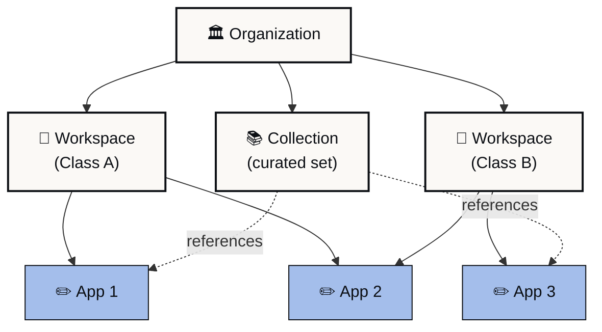

{/* TODO-VID-NAVIGATING: Walkthrough video for the four containers and how content moves between them */}
<Frame caption="Walkthrough: the four containers and how content moves between them.">
  <iframe
    src="https://www.loom.com/embed/TODO-VID-navigating"
    frameborder="0"
    webkitallowfullscreen=""
    mozallowfullscreen=""
    allowfullscreen=""
    style={{ width: "100%", height: "400px" }}
  ></iframe>
</Frame>

Playlab is organized around four clear containers. They give you direct control over your apps, sharper boundaries between classes, and ways to share what you build with the people you build for.

<Note>
 Read this first if you are new to Playlab. The rest of the docs assume you know the containers below.
</Note>

*Solid lines show containment. Dotted lines show reference (a Collection points to apps but does not own them).*

## The four containers

Everything you do in Playlab happens inside one of these four containers.

<CardGroup cols={2}>
 <Card title="Organization" icon="building">
 Your school, district, or partner. Holds workspaces, members, collections, and policies. Most people belong to one organization.
 </Card>
 <Card title="Workspace" icon="folder-tree">
 A class, team, or group inside the org. Workspaces hold members and apps, with their own activity and permissions.
 </Card>
 <Card title="App" icon="square-pen">
 A Playlab app. Lives in a workspace. Can be added to other workspaces and to collections.
 </Card>
 <Card title="Collection" icon="layers">
 A curated set of apps you can share like a single resource. Useful for partner deployments and starter packs.
 </Card>
</CardGroup>

## What each container gives you

**Your apps are yours.** New apps start private. You and your org's admins can see them. Nobody else, until you share or publish. Drafts stay yours until you're ready.

**Sharing is direct.** Add a peer as Editor or Viewer on one app. They get access to that app, not your whole workspace. You can change or revoke access at any time.

**One app, many classes.** Add the same app to as many workspaces as you need. Each class sees segmented activity. Update the app once, and every class using it sees the new version.

**Collections for curated bundles.** If you ship a set of apps to partners or districts, build a Collection once and share it. Recipients see updates as you publish them.

**Workspace controls you set.** Toggles on each workspace decide whether members can build apps, see each other's work, or share apps beyond the workspace. The settings can match the class.

**Activity at the level you need.** Workspace, member, or org. Same data, different scope. Teachers see their class. Admins see across classes.

## How content moves

Playlab lets you share an app, add it to another workspace, or include it in a collection.

<Steps>
 <Step title="An app is owned in one place">
 The person who creates the app owns it. The app lives in a single workspace.
 </Step>
 <Step title="The owner shares it">
 Sharing happens through the **Share** modal: with individuals, groups, organizations, or as a Collection.
 </Step>
 <Step title="Recipients add it where they need it">
 A teacher can add a shared app to any of their workspaces. A partner can drop a Collection into their org and use it immediately.
 </Step>
 <Step title="Updates flow automatically">
 When the owner publishes a new version, everyone with access sees the update. No re-sharing required.
 </Step>
</Steps>

<Tip>
 To put the same app in front of more than one class, see [Using an app across multiple classes](https://learn.playlab.ai/features/Cross-Workspace%20App%20Use).
</Tip>

{/* IMG-01: Annotated org dashboard showing Workspaces, Apps, Collections, Members tabs */}
<Frame caption="The organization dashboard: Workspaces, Apps, Collections, and Members are the four primary tabs.">
 
</Frame>

## Where to go next

If you build apps, your apps are private until you share them, and Editor sharing keeps collaboration scoped to a single app. See [App privacy and visibility](https://learn.playlab.ai/features/App%20Privacy%20and%20Visibility) and [Collaborating on an app](https://learn.playlab.ai/getstarted/Collaborating%20on%20an%20App).

If you teach, your workspace gives you visibility into student activity and finer control over what students can do. See [Workspace building permissions](https://learn.playlab.ai/getstarted/Workspace%20Building%20Permissions) and [Workspace member detail](https://learn.playlab.ai/features/Workspace%20Member%20Detail).

If you admin an org, you have a centralized view of activity and flags across all workspaces. See [Reviewing app activity](https://learn.playlab.ai/features/Reviewing%20App%20Activity) and [Org permissions and roles](https://learn.playlab.ai/features/Org%20Permissions%20and%20Roles).

If you deploy across a network, Collections were designed for you. See [What are Collections](https://learn.playlab.ai/features/collections/What%20are%20Collections).

## FAQ

<AccordionGroup>
 <Accordion title="Why these four containers?">
 The container structure separates the jobs that often collide on a single platform: who owns content, who can see it, who can change it, and where it shows up. Each container solves one of those jobs cleanly.
 </Accordion>
 <Accordion title="Can a workspace belong to more than one organization?">
 No. A workspace lives inside a single organization. Apps can be added to workspaces in different orgs through sharing.
 </Accordion>
 <Accordion title="Where do my apps live if I'm not in a workspace?">
 Every app lives in one workspace. If you start an app from the org dashboard, you choose which workspace owns it. You can move it later.
 </Accordion>
 <Accordion title="How is this different from Google Drive?">
 Drive is a generic file system. Playlab is built around apps and the people who use them, with sharing, activity, and permissions designed for classrooms. The container metaphor borrows from Drive because it is familiar.
 </Accordion>
  <Accordion title="Is there a mobile app?">
    Playlab runs in the browser on phones and tablets. There is no native mobile app today. Most workflows work on mobile, though detail-heavy admin views are easier on a wider screen.
  </Accordion>
  <Accordion title="Does Playlab work offline?">
    No. Playlab apps run against language models that need a network connection. Conversations sync when the connection comes back, but new sessions require live access.
  </Accordion>
</AccordionGroup>

---

Last updated: 2026-05-05

Contact us at [support@playlab.ai](mailto:support@playlab.ai)
