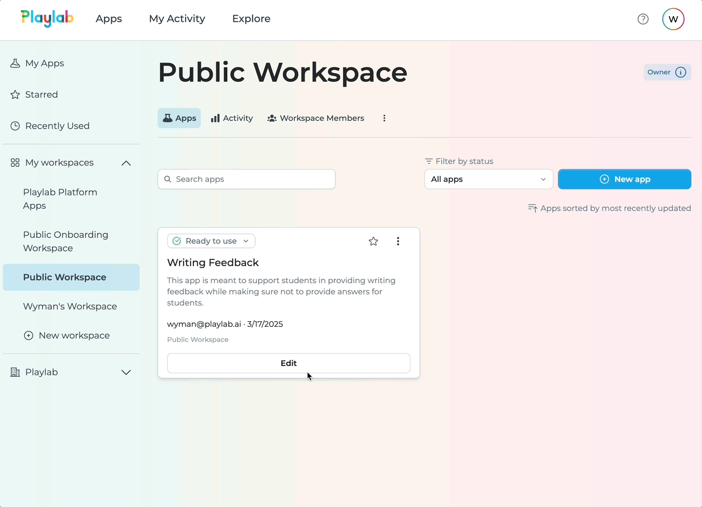
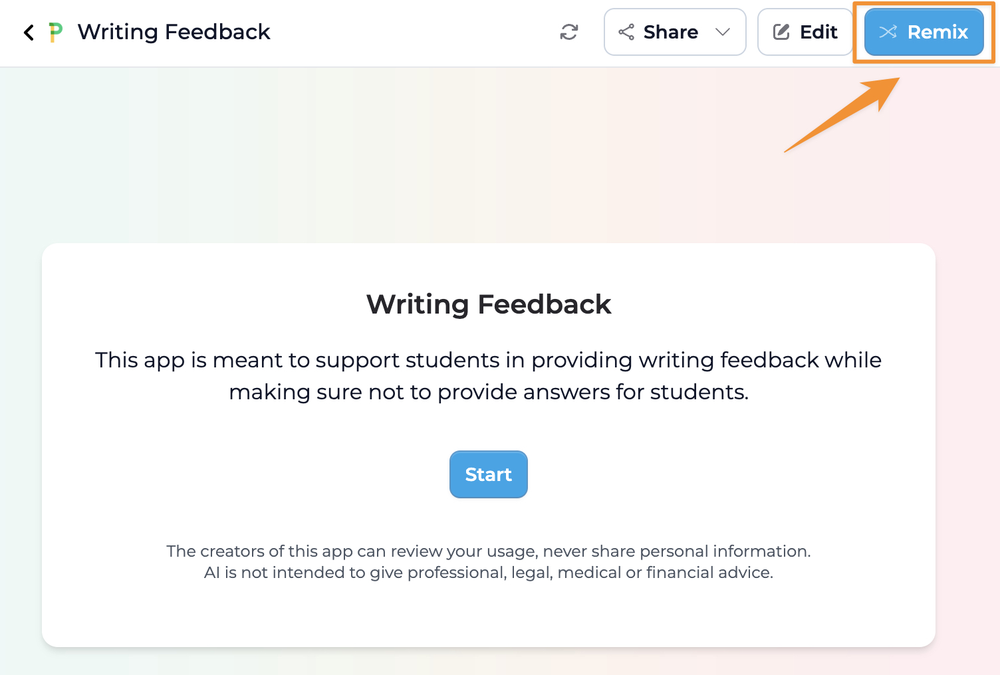
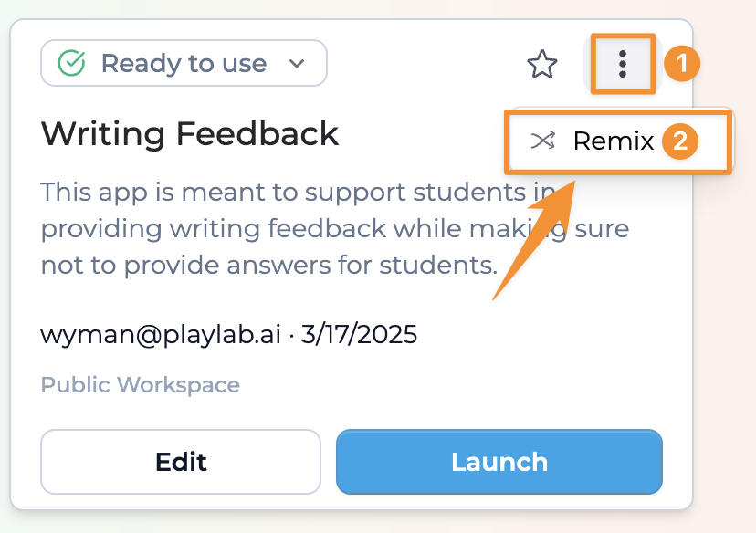
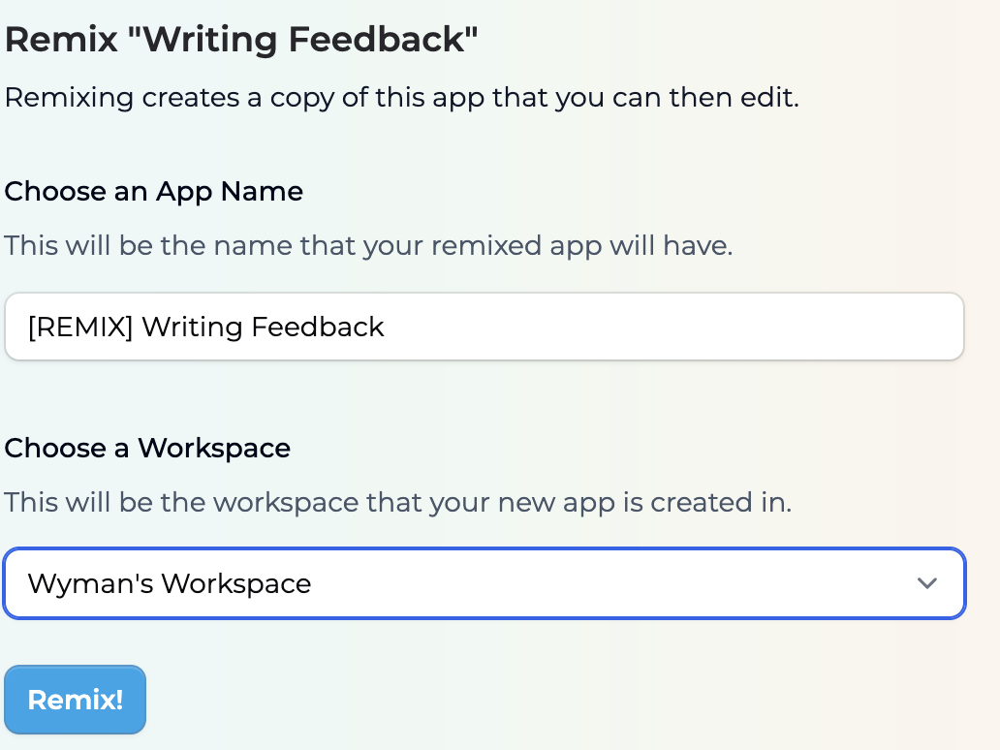

Remixing allows you to create a personal copy of an existing Playlab app. This remixed app can then be modified for your context. This guide will walk you through the process of remixing a Playlab app to customize it for your needs.

<Warning>
  **Account Required**
  
  To remix a Playlab app, you must have an active Playlab account, be logged into Playlab, and have permission to create new apps in Playlab.
</Warning>

## <Icon icon="video" size="24" className="inline-block align-text-bottom" /> Watch How to Remix a Playlab App

Watch a short clip of how to remix a Playlab app.

<Frame>
  
  <figcaption>Remixing a Playlab App</figcaption>
</Frame>

---

## <Icon icon="arrow-right" size="24" className="inline-block align-text-bottom" /> Follow these steps to remix an app:

<Steps>
  <Step title="Find an App to Remix">
    **Browse the Playlab Community or search for apps that match your needs.**
    
    1. Navigate to the [**Playlab Community**](https://playlab.ai/explore)
    2. Use filters or the search bar to find apps related to your interests
    3. Click on an app to view its details and test it out
    4. Identify the app that you want to remix
  </Step>

  <Step title="Remix the App">
    **Remix directly from an app's app card or from its published app**
    
    1. Open the app you want to remix and **Remix** from the **published version.**
    
    <Frame>
      
    </Frame>
    
    2. You can also remix it from your workspace by clicking the **"⋮"** of the app you want to remix.
    
    <Frame>
      
    </Frame>
    
    3. Click the **"Remix"** button
    4. Enter a new name for your new app. By default it will be [**REMIX] The App's Original name.**
    5. Choose which workspace to save it to (if you belong to multiple)
    
    <Frame>
      
    </Frame>
    
    6. Click **"Remix!"** to generate a copy of your new app
    7. You'll be redirected to the editor for your new remixed app
  </Step>

  <Step title="Customize Your Remixed App">
    **Make the remixed app your own by customizing its features and content.**
    
    1. Edit the app's title, description, and settings
    2. Modify the app's prompt to suit your specific use case and context
    3. Add or remove references to the app
    4. Add or remove features as needed
    5. Test your changes using the preview mode
    6. Save your changes to update your remixed app
  </Step>
</Steps>
---

## <Icon icon="lightbulb-on" size="24" className="inline-block align-text-bottom" /> Remix Best Practices

When remixing a Playlab app, keep these tips in mind:

- **Understand the original app** before making changes
- **Start with small modifications** to test functionality
- **Document your changes** as you're making revisions to the remixed app
- **Credit the original creator** when sharing your remix
- **Test thoroughly** after making significant changes
- **Share your remix** with the Playlab community if you've made valuable improvements
- **Change LLM model and variabilities** to see how they impact the performance of the app

## <Icon icon="circle-question" size="24" className="inline-block align-text-bottom" /> Frequently Asked Questions

<Accordion title="What is the difference between remixing and creating a new app?">
  When you remix an app, you start with a complete working template that you can customize. This saves time compared to creating a new app from scratch. Remixing copies all prompts, UI elements, and references, giving you a head start.
  
  Creating a new app starts with an empty canvas that you build from the ground up. Choose remix when you want to build upon someone else's work, and create a new app when you want to start from scratch.
</Accordion>

<Accordion title="Will my remixed app change the original app?">
  No, remixing an app creates a completely separate copy that is independent from the original. Any changes you make to your remixed version will not affect the original app in any way.
  
  The original creator's app remains exactly as they designed it, while you have full freedom to modify your remix without worrying about impacting the source app. This independence allows both versions to coexist and evolve separately.
</Accordion>

<Accordion title="Will the original app creator know that I remixed their app?">
  No, the original creator will not know. They have chosen to share their original app publicly, and know that their apps can be remixed and have granted permission to do so.
</Accordion>

<Accordion title="Can I remix an app that was already remixed by someone else?">
  Absolutely! You can remix any app that you have access to, including apps that are themselves remixes of other apps.
</Accordion>

<Accordion title="Do I need permission to remix someone's app?">
  No, you don't need explicit permission to remix any app that has been made public in the Playlab Gallery. Making an app public implies consent for others to remix it.
  
  However, for private apps, you need to be explicitly granted access to the app before you can remix it.
</Accordion>

<Accordion title="Can I make my remixed app private?">
  Yes, when you create a remix, you can choose to make it private to just your workspace, depending on the publishing permissions you provide.
  
  If you make significant improvements to a remixed app, we encourage you to share it with the community, but the choice is entirely yours.
</Accordion>

<Accordion title="Will updates to the original app affect my remix?">
  No, once you've remixed an app, your version becomes completely independent from the original. Updates to the original app won't automatically appear in your remix.
  
  If you want to incorporate updates from the original app, you would need to manually implement those changes or create a new remix of the updated original.
</Accordion>

<Accordion title="Can I download the references from a remixed app?">
  No, you cannot download or view the original references from a remixed app. This limitation is in place to respect the privacy and intellectual property of the original creator.
   
  When you remix an app, you'll be able to see the names of any references that were used in the original app, but you won't have access to download or view the actual content of these references. This ensures that private or proprietary materials remain protected.
   
  If you need specific references for your remixed app, you'll need to upload your own resources or reach out to the original creator directly to request permission to use their materials.
</Accordion>

## <Icon icon="bullhorn" size="24" className="inline-block align-text-bottom" /> Need Support?

If you encounter any issues while remixing a Playlab app:

* Contact us at [support@playlab.ai](mailto:support@playlab.ai)

Last updated: March 21, 2025