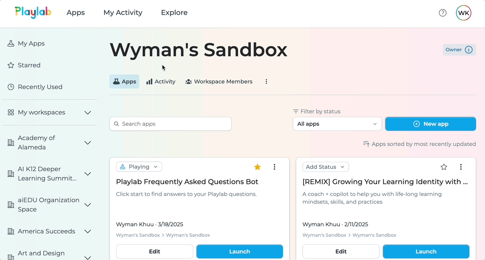
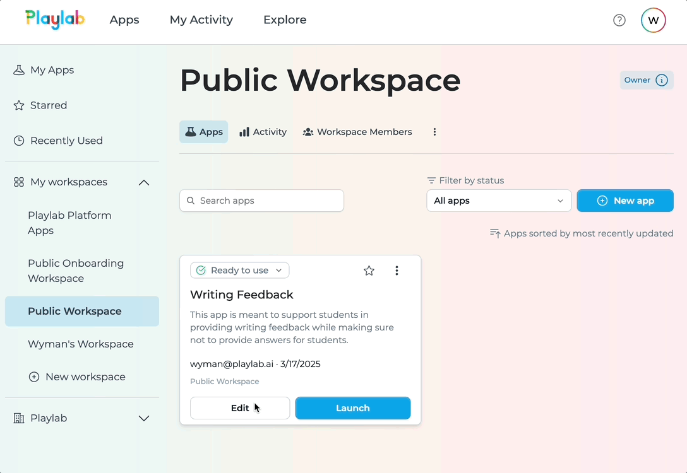

The **Activity** view allows workspace administrators and creators to monitor usage and engagement with their Playlab apps. This guide will walk you through the process of reviewing and analyzing activity data to gain insights into how your apps are being used.

<Warning>
  **Access Requirements**
  
  To review activity in Playlab, you must have appropriate permissions. Only admins and creators in the workspace can review activity.
</Warning>

## <Icon icon="video" size="24" className="inline-block align-text-bottom" /> Watch How to Review Activity in Playlab

Watch a short clip of how to review activity in Playlab.

<Frame>
  
  <figcaption>Reviewing Workspace Activity</figcaption>
</Frame>

You can also review activity in an individual app:

<Frame>
  
  <figcaption>Reviewing Individual App Activity</figcaption>
</Frame>

---

## <Icon icon="arrow-right" size="24" className="inline-block align-text-bottom" /> Follow these steps to review activity:

<Steps>
  <Step title="Access the Activity Tab">
    **Navigate to the Activity section of your workspace.**
    
    1. Go to your Playlab workspace
    2. Click on the **"Activity"** tab in the top navigation menu
    3. The activity dashboard will display recent app usage
    4. You'll see a list of apps with recent activity, along with dates and message counts
  </Step>

  <Step title="Apply Filters to Focus Your Analysis">
    **Use the dropdown filters to narrow down your view.**
    
    1. Filter by app name using the **"Apps"** dropdown
    2. Filter by specific users with the **"Users"** dropdown
    3. Set a custom date range using the date picker
    4. Toggle **"Show Community Activity"** to include or exclude public community usage
    5. The activity list will update automatically as you apply filters
  </Step>

  <Step title="Analyze the Activity Data">
    **Understand what the activity data is telling you.**
    
    1. Review app names to see which apps are being used
    2. Check user names to see who is engaging with your apps
    3. Note the dates to understand usage patterns over time
    4. Look at the message counts (indicated by the message icon) to gauge conversation depth
    5. Use pagination at the bottom of the screen to view more activity records
    6. Click on specific activity entries to view more details (if available)
  </Step>
</Steps>
---

## <Icon icon="lightbulb-on" size="24" className="inline-block align-text-bottom" /> Activity Analysis Best Practices

Consider these recommendations when analyzing activity in Playlab:

- **Look for patterns in app usage** over time to identify trends
- **Compare activity before and after updates** to measure impact of changes
- **Identify your most active users** to gather focused feedback
- **Note which apps have little to no activity** and consider ways to improve them
- **Use date filters to analyze seasonal or time-based patterns** in usage
- **Monitor community activity** to understand how public users engage with your apps
- **Review message counts** to determine which apps generate deeper conversations

## <Icon icon="circle-question" size="24" className="inline-block align-text-bottom" /> Frequently Asked Questions

<Accordion title="Who can see activity data in a workspace?">
  Activity data visibility depends on workspace permissions. Generally, workspace administrators can see all activity, while regular members may have limited visibility depending on their assigned permissions.
  
  If you need access to activity data but don't currently have it, contact your workspace administrator to request appropriate permissions.
</Accordion>

<Accordion title="What does the message count represent?">
  The message count (shown with a message icon) represents the total number of interactions between users and the app during a conversation session. Higher message counts typically indicate deeper engagement and more back-and-forth conversation with the app.
  
  This metric can help you understand which apps are generating more extensive interactions versus those that might be used for quick, single-query purposes.
</Accordion>

<Accordion title="Can I export activity data for further analysis?">
  Currently, Playlab doesn't offer a direct export feature for activity data. However, for detailed analytics needs, you can:
  
  - Save or export existing conversations
  - Enterprise organizations can export all data
  - Contact Playlab support to inquire about custom reporting options
  
  Playlab is continuously improving analytics capabilities, so export features may be added in future updates.
</Accordion>

<Accordion title="How far back does the activity history go?">
  Playlab retains activity data for the duration of the app's lifespan.
</Accordion>

<Accordion title="Why can't I see certain users' activity?">
  There are several possible reasons why you might not see activity from certain users:
  
  - The user may not have the necessary permissions to appear in activity logs
  - Your permission level might restrict which users' activity you can view
  - The user may not have used any apps during the selected time period
  - Filtering settings might be excluding that user's activity
  
  Adjust your filters and date range to ensure you're not inadvertently excluding relevant activity data.
</Accordion>

<Accordion title="What's the difference between workspace and community activity?">
  Workspace activity shows only the usage of apps by members of your workspace, which may include private apps and conversations.
  
  Community activity includes usage of your public apps by anyone in the broader Playlab community who has accessed them. The "Show Community Activity" toggle lets you include or exclude this public usage from your activity view.
</Accordion>

<Accordion title="Why do some conversations show up as anonymous?">
  If your app is used by somebody who is not in your Playlab workspace, their conversation will show up as anonymous.
  
  If you want to log their user name, you have to add that user to your Playlab workspace.
</Accordion>

## <Icon icon="bullhorn" size="24" className="inline-block align-text-bottom" /> Need Support?

If you need assistance with reviewing activity in Playlab:

* Contact us at [support@playlab.ai](mailto:support@playlab.ai)
* Join the [Playlab Community Slack](https://join.slack.com/t/playlabcommunity/shared_invite/zt-31mhwj7nl-49e1Mw5fYpyHJGOFyDIFtA)

<CardGroup>
  <Card title="Back to Getting Started" icon="arrow-left" href="/getstarted/Getting Started" iconType="duotone">
    Go back to the beginning
  </Card>
  <Card title="Building Safely" icon="shield-heart" href="/getstarted/Building Safely" iconType="duotone">
    Learn how to build safely in Playlab
  </Card>
</CardGroup>

Last updated: March 21, 2025