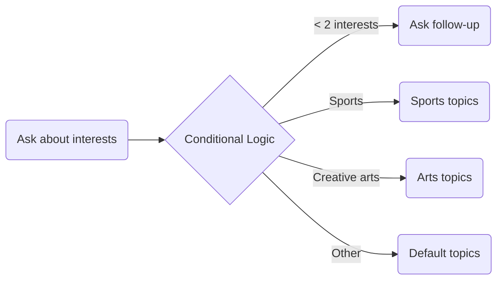

## <Icon icon="circle-question" size="24" className="inline-block align-text-bottom" /> What is this strategy?

This strategy focuses on effectively implementing conditional logic in your Playlab prompts. By structuring your prompts with if-then statements, you can guide AI responses differently depending on various scenarios, user inputs, or conditions, creating more dynamic and personalized interactions.

<Warning>Complex conditional statements can be difficult to track and might confuse the model if not clearly defined.</Warning>

## <Icon icon="lightbulb" size="24" className="inline-block align-text-bottom" /> Why It's Important

Conditional logic represents a powerful technique in prompt engineering. When properly implemented, conditional prompts can:

* Create dynamic, branching conversations based on user input
* Personalize responses to different user needs and contexts
* Handle edge cases and unexpected inputs more gracefully
* Enable more nuanced and adaptive AI-generated content
* Improve the relevance and helpfulness of responses

## <Icon icon="list-ol" size="24" className="inline-block align-text-bottom" /> Implementation Steps
Leverage this suggested template to help you build with conditional logic in your Playlab apps

<Steps>
  <Step title="Define Your Base Prompt">
    Start with a clear base prompt that outlines the fundamental task or interaction.
    
    **Example:**
    "Ask the student what they are interested in."
    
    A well-defined base prompt establishes the foundation for your conditional statements.
  </Step>
  
  <Step title="Identify Key Conditions">

    **Conditions**
    
    Define the different scenarios that might occur based on user inputs:
    
    * If **[condition1]**
    * Else if **[condition2]**
    * Else if **[condition3]**
    * Otherwise (default)
    
    **Example:**
    * If the student does not provide at least two interests
    * If the student mentions sports
    * If the student mentions creative arts
    
    Clear conditions help the model recognize different scenarios and respond appropriately.
  </Step>
  
  <Step title="Specify Actions for Each Condition">
    
    **Actions**
    
    Define what the model should do for each condition:
    
    * If [condition1], then **[action1]**
    * Else if [condition2], then **[action2]**
    * Else if [condition3], then **[action3]**
    * Otherwise, **[default action]**
    
    **Example:**
    * If the student does not provide at least two interests, then ask a probing question about what the student does for fun.
    * If the student mentions sports, then suggest essay topics related to teamwork, competition, and personal growth.
    * If the student mentions creative arts, then suggest essay topics related to expression, creativity, and cultural impact.
    
    Specific actions ensure the model knows exactly how to respond to each condition.
  </Step>
  
  <Step title="Test and Refine">
    
    Try your conditional prompt with various inputs to ensure it handles all cases correctly.
    
    * Start with simple conditionals and gradually increase complexity
    * Test edge cases and unexpected inputs
    * Refine conditions and actions based on results
    
    Iterative testing helps identify and fix issues before deploying your app.
  </Step>
</Steps>

## <Icon icon="circle-question" size="24" className="inline-block align-text-bottom" /> Frequently Asked Questions

<Accordion title="How complex can conditional statements be in Playlab?">
  While Playlab can handle multi-level conditional statements, we recommend keeping them manageable. If your logic becomes too complex with many nested conditions, consider breaking it into smaller, more focused prompts or use a different approach. As a general rule, if you're having trouble keeping track of your conditionals, the model might struggle too.
</Accordion>

<Accordion title="Can I combine conditional logic with other prompting strategies?">
  Absolutely! Conditional logic works well with other strategies like chain-of-thought reasoning, structured outputs, and few-shot learning. For example, you might use different few-shot examples depending on a condition, or change the structure of your output based on the user's expertise level.
</Accordion>

<Accordion title="How do I handle unexpected or ambiguous user inputs?">
  Always include a default action (the "Otherwise" clause) to handle cases that don't match your defined conditions. Additionally, consider adding conditions that check for ambiguity in user input and respond by asking clarifying questions before proceeding with the main task.
</Accordion>

## <Icon icon="bullhorn" size="24" className="inline-block align-text-bottom" /> Need Support?

<Info>
  Have you tried building with different LLM models? We'd love to hear about your experience!

  Join the discussion in our [Playlab Slack Channel](https://join.slack.com/t/playlabcommunity/shared_invite/zt-31mhwj7nl-49e1Mw5fYpyHJGOFyDIFtA).

  Contact us at [support@playlab.ai](mailto:support@playlab.ai)
</Info>

  <Button href="../index.md">Return to Home Page</Button>

Last updated: April 3, 2025