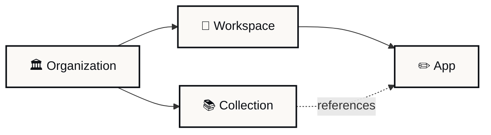

If you read another V2 doc and hit a term you do not recognize, look it up here. Each entry links to the page where the term is used in depth.

<Note>
  Some role names may shift between this draft and launch. Confirm with your org admin if a name does not match what you see in the product.
</Note>

## Containers

The four places content lives in V2.

**Organization (Org)**

The top-level container. Usually a school, district, university, or partner. Holds workspaces, members, collections, and policies. Most people belong to a single organization. See [Navigating Playlab V2](https://learn.playlab.ai/getstarted/Navigating%20Playlab%20V2).

**Workspace**

A class, team, project, or group inside an organization. A workspace has its own members, apps, activity, and building permissions. Workspaces are created by educators and admins.

**App**

A Playlab app. Lives in a single workspace as its home, but can be added to other workspaces and to collections without being remixed. Each app has one owner and any number of editors and viewers.

**Collection**

A curated set of apps you can share like a single resource. Useful when you want to bundle several apps for a partner, a curriculum unit, or a starter pack. Updates propagate to everyone with access. See [What are Collections](https://learn.playlab.ai/features/collections/What%20are%20Collections).

## Roles

Who can do what.

**Org Admin**

Manages the entire organization. Sees all workspaces, all member activity, and all flagged messages. Can change member roles and configure org-level settings.

**Workspace Manager**

Manages a single workspace. Can add and remove members, change permissions, add apps, and review activity for everyone in the workspace.

**Workspace Member**

A member of a workspace. Can use apps in the workspace and, depending on building permissions, may also create or share their own apps.

**App Owner**

The person who created an app. Owns the app, controls who can edit, and decides what to publish.

**Editor**

A person you have shared an app with at the editor level. Can edit the app's instructions, references, and settings. Cannot reassign ownership. See [Collaborating on an app](https://learn.playlab.ai/getstarted/Collaborating%20on%20an%20App).

**Viewer**

A person you have shared an app with at the viewer level. Can use the app but not change it.

## Capabilities

Things you do with V2.

**Sharing**

Granting access to an app or collection. Done through the **Share** modal. You can share with individuals, groups, or organizations and pick a permission level for each. See [Sharing with individuals](https://learn.playlab.ai/features/Sharing%20with%20Individuals) and [Sharing with groups and orgs](https://learn.playlab.ai/features/Sharing%20with%20Groups%20and%20Orgs).

**Publishing**

Making an app available beyond direct sharing. Publishing happens from the app builder or the **Share** modal and lets you set a visibility level. See [Publishing your app in V2](https://learn.playlab.ai/features/Publishing).

**Privacy by default**

In V2, every new app is private to the owner and the org's admins until the owner shares or publishes it. This replaces V1's default of "visible to the workspace." See [App privacy and visibility in V2](https://learn.playlab.ai/features/App%20Privacy%20and%20Visibility).

**Building permissions**

Workspace-level toggles that control whether students can build apps, see each other's work, or share apps beyond the workspace. Set on workspace creation and editable later. See [Workspace building permissions](https://learn.playlab.ai/getstarted/Workspace%20Building%20Permissions).

**Activity**

The record of who used an app, when, and what conversations took place. Available at the workspace level, the member level, and the org level. See [Reviewing student activity per class](https://learn.playlab.ai/getstarted/Reviewing%20Activity).

**Flags**

A flagged message is a conversation that triggered a safety or moderation rule. In V2, all flags from across the org are surfaced in a centralized dashboard for org admins. See [Centralized org monitoring](https://learn.playlab.ai/features/Reviewing%20App%20Activity).

**Cross-workspace use**

Adding the same app to multiple workspaces without remixing. Activity stays segmented per workspace, and updates flow from the original app. Replaces the V1 "remix per class" pattern. See [Using an app across multiple classes](https://learn.playlab.ai/features/Cross-Workspace%20App%20Use).

## Old terms that changed

Quick translation table for familiar V1 vocabulary.

| V1 term | V2 equivalent | Why |
| --- | --- | --- |
| **Creator** (workspace role) | **Editor** (per app) | Collaboration moved from the workspace to the app. |
| **Remix to deploy** | **Add app** to workspace | One canonical app, used in many classes. |
| **Remix for partners** | **Collection** | One curated bundle, shared with many partners. |
| **Workspace activity** | **Workspace activity** plus **Member detail** | Same view, with new ability to drill into a single member. |
| **Workspace-only app** | **Privacy** + **Sharing** | Visibility is now controlled by privacy settings and explicit sharing. The workspace an app lives in no longer determines who can see it. |

## Want a term added?

If you see a term in another V2 doc that should be defined here, email [support@playlab.ai](mailto:support@playlab.ai) and we will add it.

---

Last updated: 2026-05-05

Contact us at [support@playlab.ai](mailto:support@playlab.ai)
